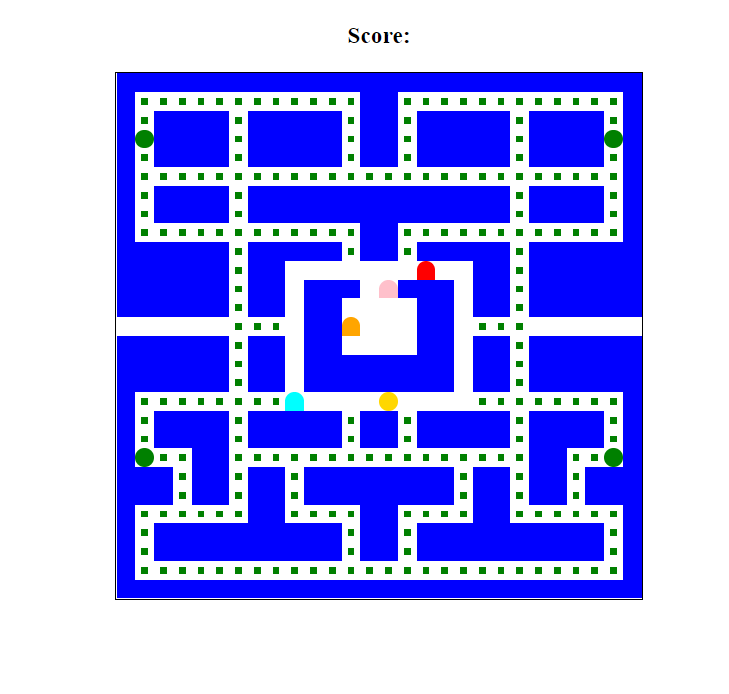

## Pacman

## Summary

This is a pacman clone that I started with a template (the majority of the game board grid and starting gameplay logic was borrowed). I used this as an opportunity to add on to it while brushing up on methods I don't normally use, dynamic styles with adding + removing classLists, as well as implementing objects, classes, constructors and import + export statements.

 

 

 

This is one of a few vanilla JS projects that I've been making lately to solidify core JS concepts and familiarize myself with more built-in methods.

 

 

  
  

**Author**
 
**Robin Fussell** _- Software Developer_ | [LinkedIn](https://www.linkedin.com/in/robin-fussell17/)